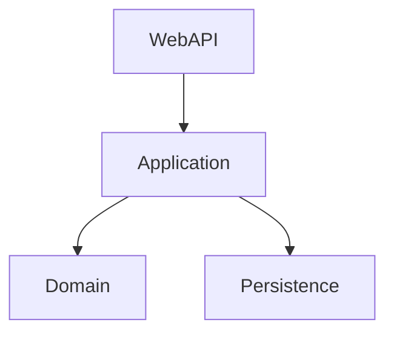

## News Scraping

[](#)
[](#)
[](#)
[](#)

An application that automatically scrapes news from the Instituto Federal do Pará (IFPA) website and sends it via email to the community.

### About

A problem at IFPA is the dissemination of information. The institutional website has a low traffic,
and as a result, all the news posted there requires manual work to send the information directly to community. 
Therefore, I decided to develop an application that automates this work and helps IFPA and the academic community.

### Application

The application was built following [Clean Architecture](https://blog.cleancoder.com/uncle-bob/2012/08/13/the-clean-architecture.html)
principles and includes the following features:

- API endpoint for email address registration
- Scraping news from [IFPA Website](https://ifpa.edu.br/)
- Automated email sending

The project follows a **monolithic architecture** and is organized into four main layers with the following dependency flow:



#### Domain
Contains the core business logic and domain entities.  
This layer is entirely independent of external frameworks or technologies, focusing solely on modeling the problem domain.

#### Application
Implements the application's use cases and coordinates the business rules.  
It leverages **MediatR** to handle commands and queries.

#### Persistence
Responsible for data access and storage.  
It applies the **Repository pattern** and uses **Entity Framework Core** to manage interactions with a **MySQL** database, abstracting persistence logic from higher layers.

#### WebAPI
Serves as the system's entry point, exposing RESTful endpoints for external access.  
In addition to handling HTTP requests, this layer also hosts a **background service** configured as a **cron job**, which periodically triggers the scraping and email-sending processes. It communicates with the `Application` layer through MediatR, maintaining strict separation of concerns.

### Requirements
- [Docker](https://www.docker.com/)
 
### How to use

 Clone repository

```bash
  git clone "git@github.com:wendellmoraisz/news-scraping-monolithic.git"
  cd NewsScrapingMonolithic
```

Fill environment variables on `docker-compose.override.yml` and run it:

```bash
  # Build
  docker-compose -f docker-compose.yml -f docker-compose.override.yml up --build

  # Run
  docker-compose -f docker-compose.yml -f docker-compose.override.yml up
```
